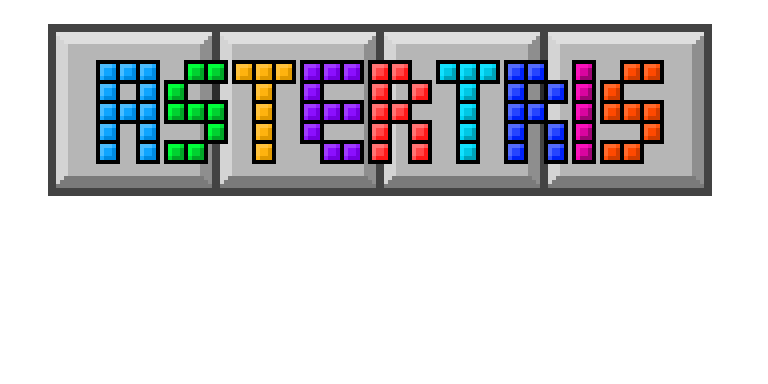

# Astertris (Beta)

**Astertris** is a custom Java implementation of <strong>Tetris</strong> with a unique twist — radial gravity mechanics set in space!  
Inspired by the original <strong>Tetris</strong> game, Astertris adds new gameplay challenges while staying true to the original's addictive feel.

---

## 🎮 Features
- **Core Tetris Mechanics** – Rotate, move, and place tetrominoes to clear lines.  
- **Radial Gravity** – Blocks fall toward the center of the playfield instead of straight down.  
- **Custom Rendering** – Built using `Swing` with a `BoardPanel` component to visualize the game grid.  
- **Scalable Grid System** – Grid cell size can be adjusted (`cellSize = 10` by default).  ``

---

## 🛠️ Tech Stack
- **Language:** Java (JDK 8+)  
- **GUI Framework:** Swing (`JPanel`, `Graphics`)  

---

## ⚠️ Project Status
This project is currently in **Beta**.  
Some features are not fully implemented yet.

---

## Download
[Latest Version (Beta 1.5.0)](https://github.com/pixelhypercube/Astertris/releases/tag/beta-1.5.0)

---

### Demo

